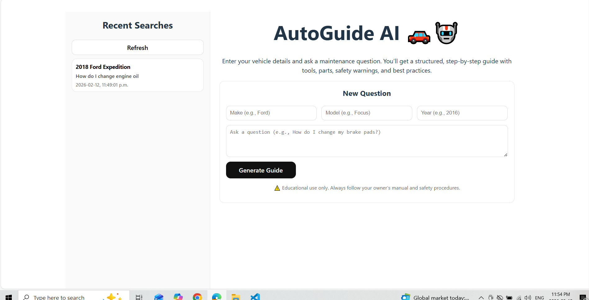
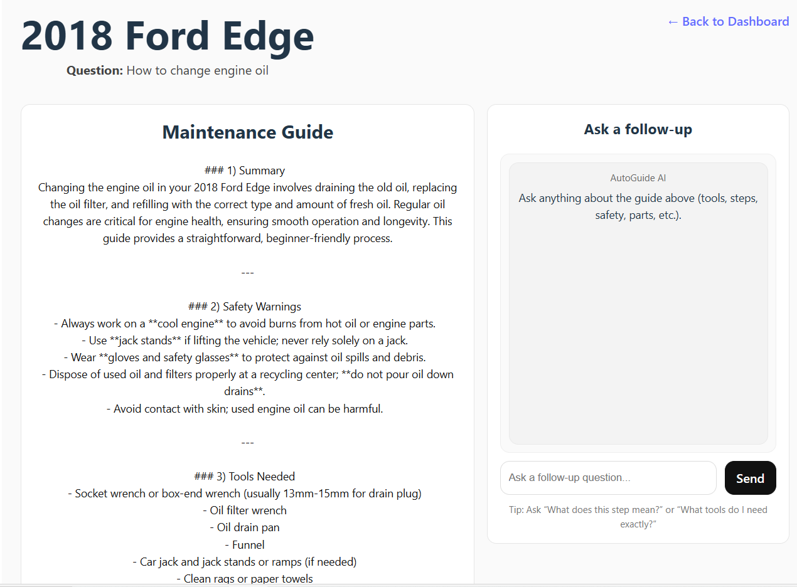

# AutoGuide AI 🚗🤖  
### AI-Powered Automotive Maintenance Assistant

AutoGuide AI is a full-stack web application that helps users understand vehicle maintenance and repair tasks using AI-generated, structured guidance.

Users can enter a vehicle’s make, model, and year, ask a maintenance question in natural language, and receive step-by-step instructions including tools, parts, safety warnings, and best practices. The application also supports contextual follow-up chat and persistent search history.

---

## 🌐 Live Demo

Frontend:  
https://autoguide-ai.vercel.app

Backend API:  
https://autoguide-ai.onrender.com/health  

---

## 🚀 Project Overview

AutoGuide AI demonstrates:

- Full-stack development using React and Node.js  
- Integration with an AI API to generate structured technical guidance  
- MongoDB Atlas for persistent storage  
- RESTful API design  
- Modern responsive UI built with Tailwind CSS  
- Persistent chat history per guide  
- Loading states and error handling  
- Deployment to Vercel and Render  

---

## ✨ Key Features

- Vehicle-specific maintenance guidance  
- Natural language question input  
- Structured AI responses including:
  - Safety warnings  
  - Required tools  
  - Parts to purchase  
  - Step-by-step instructions  
- Recent search history stored in MongoDB  
- Follow-up chat with context retention  
- Copy-to-clipboard for steps and sections  
- Regenerate answer feature  
- Clean, responsive Tailwind UI  
- Persistent chat history  

---

## 🧠 Architecture Diagram

    User Browser
         │
         ▼
    React Frontend (Vercel)
         │  REST API Calls (Axios)
         ▼
    Node.js + Express Backend (Render)
         │
         ├── OpenAI API (Guide Generation)
         │
         └── MongoDB Atlas
                 ├── Guides
                 ├── Chat History
                 └── Searches

This architecture demonstrates a production-style separation of concerns:
- Frontend handles UI and state  
- Backend handles business logic and AI integration  
- Database handles persistence  
- External AI service handles structured content generation  

---

## 🛠️ Tech Stack

### Frontend
- React (Vite)
- Tailwind CSS
- Axios
- React Router

### Backend
- Node.js
- Express.js
- MongoDB Atlas
- OpenAI API
- dotenv
- Mongoose

### Deployment
- Vercel (Frontend)
- Render (Backend)

### Tools
- Visual Studio Code
- Git & GitHub
- REST APIs

---

## 📁 Project Structure

    autoguide-ai/
    │
    ├── frontend/
    │   ├── src/
    │   │   ├── pages/
    │   │   ├── components/
    │   │   ├── api/
    │   │   └── App.jsx
    │   └── package.json
    │
    ├── backend/
    │   ├── models/
    │   ├── db.js
    │   ├── server.js
    │   └── package.json
    │
    ├── screenshots/
    │   ├── main-ui.png
    │   ├── results.png
    │   └── chat.png
    │
    ├── README.md
    └── .gitignore

---

## 📸 Screenshots

### Dashboard

### Generated Guide

---

## ▶️ Getting Started (Local Setup)

### 1. Clone Repository

    git clone https://github.com/aninan1512/autoguide-ai.git
    cd autoguide-ai

---

### 2. Backend Setup

    cd backend
    npm install

Create a `.env` file inside `backend/`:

    PORT=5000
    MONGODB_URI=your_mongodb_connection_string
    DB_NAME=autoguide_ai
    OPENAI_API_KEY=your_openai_api_key
    FRONTEND_URL=http://localhost:5173

Start backend:

    npm run dev

Backend runs on:

    http://localhost:5000

---

### 3. Frontend Setup

    cd ../frontend
    npm install
    npm run dev

Frontend runs on:

    http://localhost:5173

---

## 🔌 Core API Endpoints

### Guides

    POST /api/guides
    GET  /api/guides/:id
    POST /api/guides/:id/regenerate

### Chat

    POST /api/chat

### Searches

    GET /api/searches

### Health

    GET /health

---

## ⚠️ Disclaimer

This application provides AI-generated guidance for educational purposes only.  
Always consult your vehicle’s owner manual or a certified mechanic before performing maintenance or repairs.

---

## 🚀 Future Improvements

- User authentication  
- Saved vehicles ("My Garage")  
- VIN decoding integration  
- Printable maintenance guides  
- Push notifications and service reminders  
- Retrieval-Augmented Generation (RAG)  

---

## 📌 Why This Project Matters

This project demonstrates real-world engineering practices including:

- Full-stack architecture  
- API design and integration  
- Database modeling and persistence  
- Structured prompting for AI systems  
- Responsive UI design  
- Deployment and environment configuration  
- Error handling and UX improvements  

These skills directly translate to production software engineering roles.

---

## 👤 Author

**Aaron Ninan**  
B.Sc. Computer Science  
Full-Stack Developer  

GitHub:  
https://github.com/aninan1512  

LinkedIn:  
https://www.linkedin.com/in/aaron-ninan-798938287

